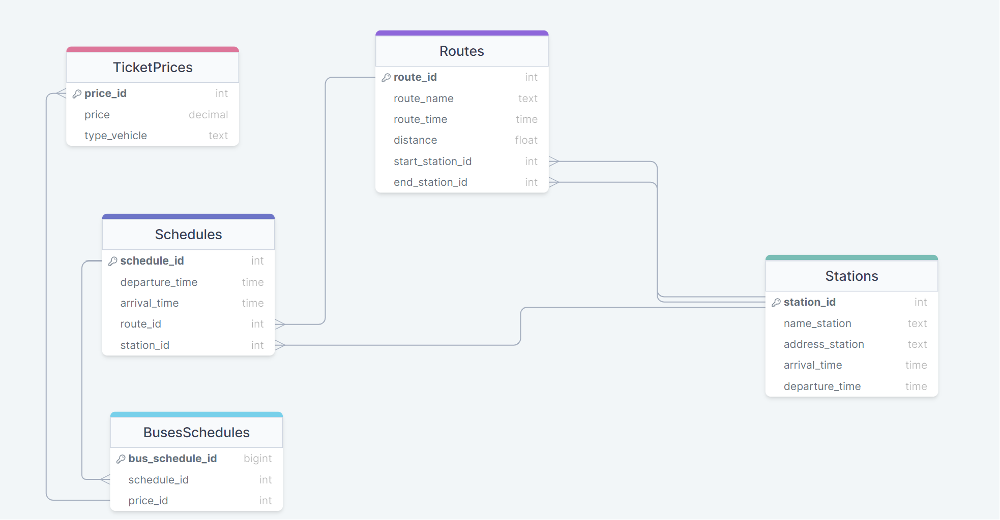

# DataBase_Vyklynets
Виклинець Артур Вікторович
ІПЗ - 21
Тема курсової: Розклад маршрутів руху транспортних засобів
Посилання на діаграму:   https://drawsql.app/teams/jj-47/diagrams/rozklad-marshrutiv-ruhu-tz
  
Routes
|   Назва атрибуту  | Тип даних |               Опис              |
|-------------------|-----------|---------------------------------|
| route_id          | BIGSERIAL | Унікальний ідентифікатор        |
| route_name        | TEXT      | Назва маршруту                  |
| route_time        | INTERVAL  | Приблизний час маршруту         |
| distance          | DECIMAL   | Відстань маршруту               |
| start_station_id  | BIGINT    | Ідентифікатор початкової cтанції|
| end_station_id    | BIGINT    | Ідентифікатор кінцевої станції  |       

TicketPrices
|   Назва атрибуту  | Тип даних |               Опис              |
|-------------------|-----------|---------------------------------|
| price_id          | BIGSERIAL | Унікальний ідентифікатор        |
| price             | NUMERIC   | Ціна проїзду                    |
| type_vehicle      | TEXT      | Тип транспорту                  |

Schedules
|   Назва атрибуту  | Тип даних |               Опис              |
|-------------------|-----------|---------------------------------|
| schedule_id       | BIGSERIAL | Унікальний ідентифікатор        |
| departure_time    | TEXT      | Час відправлення                |
| arrival_time      | TIME      | Час прибуття                    |
| route_id          | BIGSERIAL | унікальний ідентифікатор        |

Stations
|   Назва атрибуту  | Тип даних |               Опис              |
|-------------------|-----------|---------------------------------|
| station_id        | INT       | Унікальний ідентифікатор        |
| name_station      | TEXT      | Назва станції                   |
| address_station   | TEXT      | Адреса станції                  |

BusesSchedules
|   Назва атрибуту  | Тип даних |               Опис               |
|-------------------|-----------|----------------------------------|
| bus_schedule_id   | BIGSERIAL | Унікальний ідентифікатор         |
| schedule_id       | BIGINT    | Унікальний ідентифікатор розкладу|
| price_id          | BIGINT    | Унікальний ідентифікатор ціни    |

IntermediateStations
|   Назва атрибуту  | Тип даних |               Опис               |
|-------------------|-----------|----------------------------------|
| id                | BIGSERIAL | Ідентифікатор проміжної станції  |
| station_id        | BIGINT    | Унікальний ідентифікатор зупинки |
| route_id          | BIGINT    | Унікальний ідентифікатор маршруту|
| sequence          | INT       | Послідовність проміжних станцій  |
