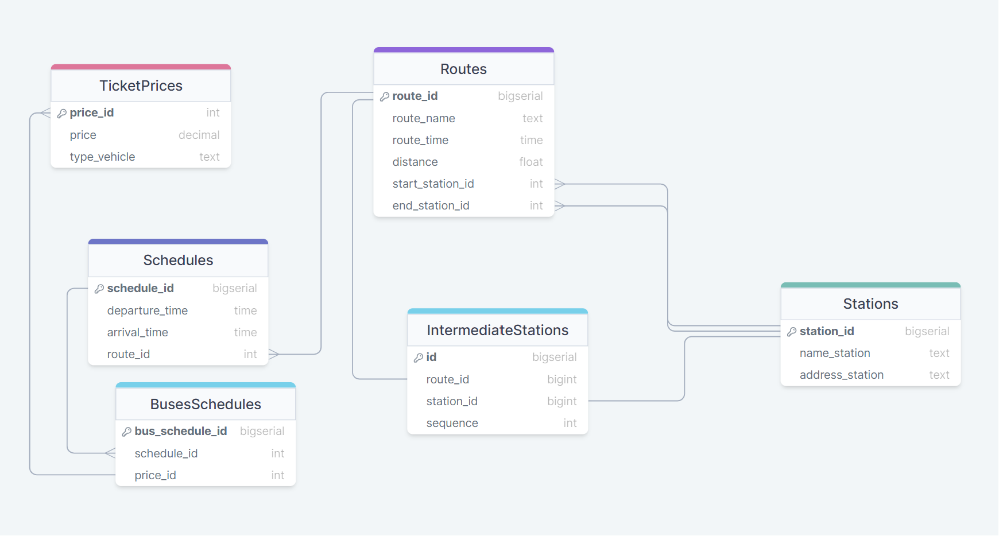

# DataBase_Vyklynets
Виклинець Артур Вікторович
ІПЗ - 21
Тема курсової: Розклад маршрутів руху транспортних засобів
Посилання на діаграму:   https://drawsql.app/teams/jj-47/diagrams/rozklad-marshrutiv-ruhu-tz
  
Routes
|   Назва атрибуту  | Тип даних |               Опис              |
|-------------------|-----------|---------------------------------|
| route_id          | INT       | Унікальний ідентифікатор        |
| route_name        | TEXT      | Назва маршруту                  |
| route_time        | TIME      | Приблизний час маршруту         |
| distance          | FLOAT     | Відстань маршруту               |
| start_station_id  | INT       | Ідентифікатор початкової cтанції|
| end_station_id    | INT       | Ідентифікатор кінцевої станції  |       

TicketPrices
|   Назва атрибуту  | Тип даних |               Опис              |
|-------------------|-----------|---------------------------------|
| price_id          | INT       | Унікальний ідентифікатор        |
| price             | DECIMAL   | Ціна проїзду                    |

Vehicles
|   Назва атрибуту  | Тип даних |               Опис              |
|-------------------|-----------|---------------------------------|
| vehicle_id          | INT       | Унікальний ідентифікатор      |
| type_vehicle        | TEXT      | Вид транспорту                |

Schedules
|   Назва атрибуту  | Тип даних |               Опис              |
|-------------------|-----------|---------------------------------|
| schedule_id       | INT       | Унікальний ідентифікатор        |
| departure_time    | TEXT      | Час відправлення                |
| arrival_time      | TIME      | Час прибуття                    |

Stations
|   Назва атрибуту  | Тип даних |               Опис              |
|-------------------|-----------|---------------------------------|
| station_id        | INT       | Унікальний ідентифікатор        |
| name_station      | TEXT      | Назва станції                   |
| address_station   | TEXT      | Адреса станції                  |

BusesSchedules
|   Назва атрибуту  | Тип даних |               Опис               |
|-------------------|-----------|----------------------------------|
| route_id          | INT       | Унікальний ідентифікатор маршруту|
| schedule_id       | INT       | Унікальний ідентифікатор розкладу|
| start_station_id  | INT       | Унікальний ідентифікатор станції |
| end_station_id    | INT       | Унікальний ідентифікатор станції |
| vehicle_id        | INT       | Унікальний ідентифікатор тс.     |
| price_id          | INT       | Унікальний ідентифікатор ціни    |
